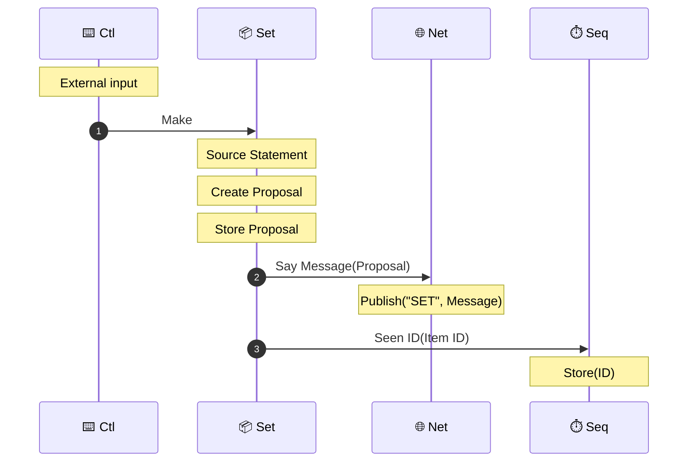
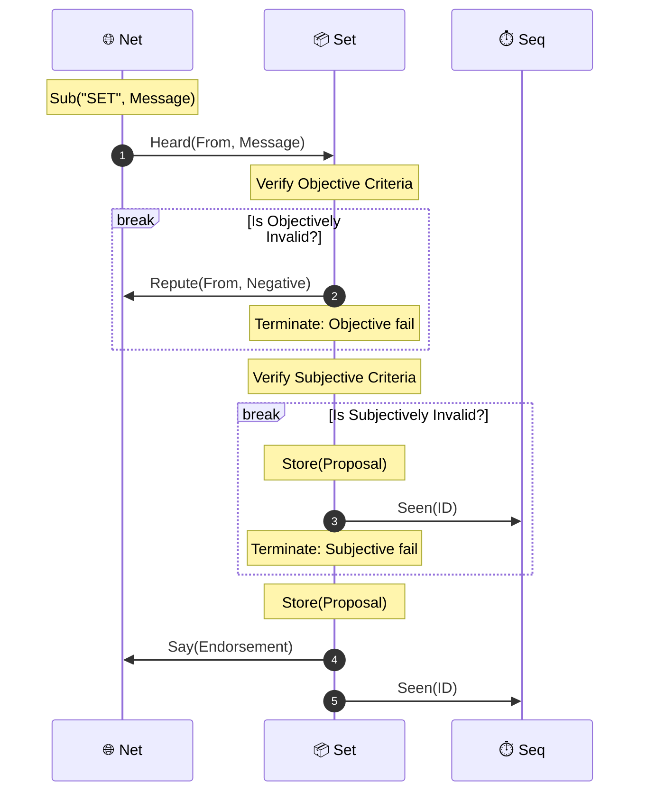
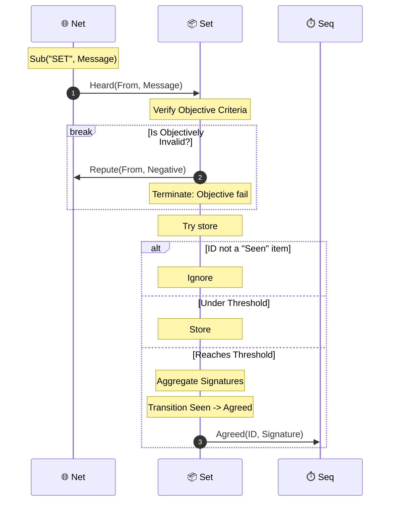
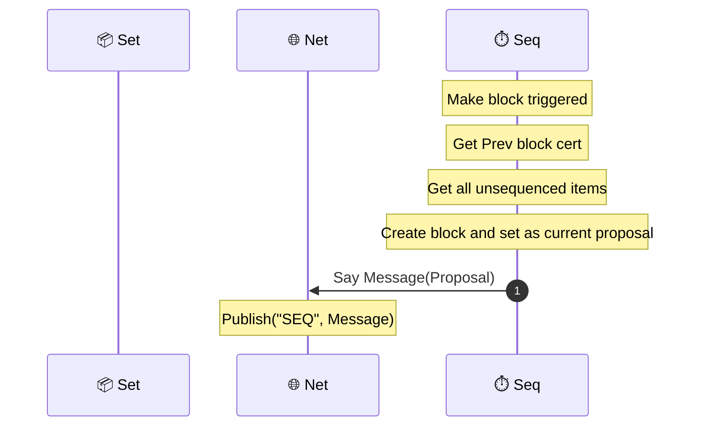
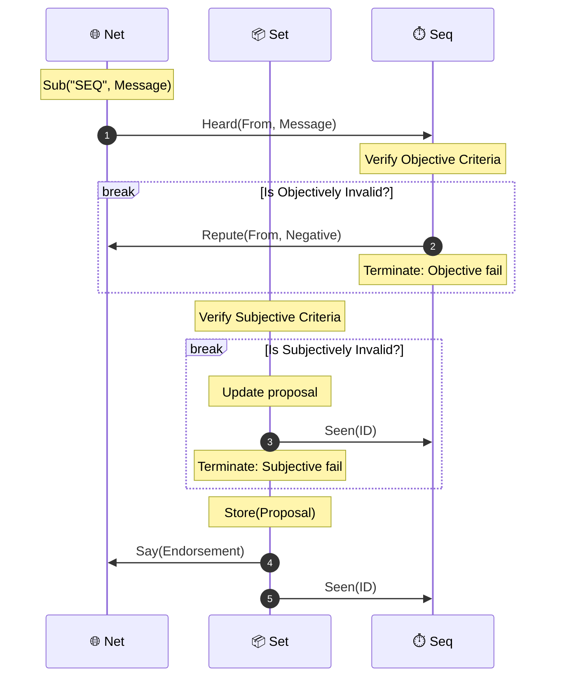
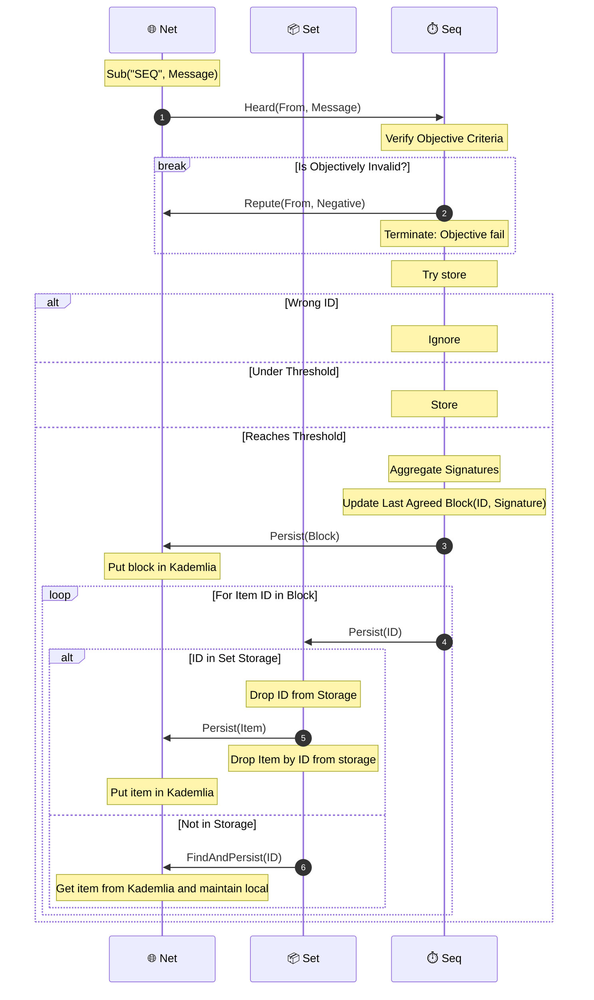

## Melon

### Bootstrap

We rely on kademlia to bootstrap network and maintain peers. We rely on
gossipsub to manage active and passive nodes.

## Item Lifecycle

The following diagram concerns a melon network with 5 participants.

It coveys the lifecycle of an item from proposal through to settled. This is the
happy path where all nodes agree on Alice's item.

The connection is all-to-all. For larger networks, the messages are propogated
via gossip, as opposed to flood as diagrammed.

```mermaid
sequenceDiagram
    autonumber

    participant A as 👩‍💻 Alice
    participant B as 👨‍💼 Bob
    participant C as 🕵️‍♂️ Charlie
    participant D as 👩‍🔬 Delta
    participant E as 🦹‍♀️ Eve

    %% --- Section: Propose Item ---
    Note over A, E: Section: Propose Item
    Note over A, E: Alice initiates the lifecycle by making an item and broadcasting.
    A->>B: Proposal(Item)
    A->>C: Proposal(Item)
    A->>D: Proposal(Item)
    A->>E: Proposal(Item)


    %% --- Section: Endorse Item ---
    Note over A, E: Section: Endorse Item
    rect rgb(30, 41, 59)
        par All-to-All Endorsement
            B->>A: Endorse(Item)
            B->>C: Endorse(Item)
            B->>D: Endorse(Item)
            B->>E: Endorse(Item)
        and
            C->>A: Endorse(Item)
            C->>B: Endorse(Item)
            C->>D: Endorse(Item)
            C->>E: Endorse(Item)
        and
            D->>A: Endorse(Item)
            D->>B: Endorse(Item)
            D->>C: Endorse(Item)
            D->>E: Endorse(Item)
        and
            E->>A: Endorse(Item)
            E->>B: Endorse(Item)
            E->>C: Endorse(Item)
            E->>D: Endorse(Item)
        end
    end

    Note over A, E: Threshold Reached: Item status becomes "Agreed" internally

    %% --- Section: Sequenced ---
    Note over A, E: Section: Block proposal || Sequence Item

    B->>A: Block Proposal(Inc Item Id)
    B->>C: Block Proposal(Inc Item Id)
    B->>D: Block Proposal(Inc Item Id)
    B->>E: Block Proposal(Inc Item Id)

    Note over A, E: Bob acts as the Sequencer proposing the agreed item in a block.

    %% --- Section: Block Endorsement ---
    Note over A, E: Section: Block Endorsement

    rect rgb(30, 41, 59)
        par All-to-All Block Endorsement
            A->>B: Endorsement(Block ID)
            A->>C: Endorsement(Block ID)
            A->>D: Endorsement(Block ID)
            A->>E: Endorsement(Block ID)
        and
            C->>A: Endorsement(Block ID)
            C->>B: Endorsement(Block ID)
            C->>D: Endorsement(Block ID)
            C->>E: Endorsement(Block ID)
        and
            D->>A: Endorsement(Block ID)
            D->>B: Endorsement(Block ID)
            D->>C: Endorsement(Block ID)
            D->>E: Endorsement(Block ID)
        and
            E->>A: Endorsement(Block ID)
            E->>B: Endorsement(Block ID)
            E->>C: Endorsement(Block ID)
            E->>D: Endorsement(Block ID)
        end
    end

    %% --- Section: Block Proposal (Settlement) ---
    Note over A, E: Section: Block Proposal || Settle Item
    Note over A, E: Charlie's block contains aggregate signature of Bob's block

    C->>A: Block Proposal(Inc Prev Block Cert)
    C->>B: Block Proposal(Inc Prev Block Cert)
    C->>D: Block Proposal(Inc Prev Block Cert)
    C->>E: Block Proposal(Inc Prev Block Cert)

    Note over A, E: Alice's item is now settled, and must be persisted by all nodes.
```

## Component sequences

These sequences run through the message passing between a nodes internal
components.

### Propose item

The first stage in an item's lifecycle.

For now these are triggered by Ctl. This leaves open the possibility of two
nodes proposing similar items. In future, this will be changed.

The make command can also trigger multiple items being made concurrently. Each
item is handled independently.

### Endorse item

A node recieves (hears) a message over gossip. Specifically on the "SET" topic.

The net service dispatches the message to the Set service. Set messages either
contain a proposal or an endorsement. Under normal operation, a node will see
the proposal before any associated endorsemnet.

A node verifies the proposal against "Objective" and "Subjective" criteria:

- Step 1: Objectively valid. A proposal that satisfies "objective" criteria is
  deemed objectively valid. Otherwise it is objectively invalid. For example,
  the signature is wrong. Objectively invalid messages result in negative repute
  for the source of the proposal.
- Step 2: Subjectively valid. An objectively valid proposal that satisifies
  "subjective" criteria is deemed subjectively valid. Otherwise it is
  subjectively invalid. For example, a value in the body of a statement diverges
  too much from the nodes perceived value. There is nothing provably wrong, but
  the node cannot endorse the statement.

On a verified proposal, the Set service stores the proposal and broadcasts an
endorsement.

### Agree Item

A node recieves (hears) a message over gossip. Specifically on the "SET" topic.

The Net service dispatches the message to the Set service. Here we consider the
case the message contains an endorsement.

Again the node verifies the endorsement against "Objective" criteria. Again, a
failure results in neagtive repute.

Set attempts to store a valid endorsement. Each endorsement adds a signature.

We have the following cases:

- Endorsement does not correspond to a "Seen" item. Either, the node has never
  seen the item, or has already transitioned the item to "Agreed".
- Endorsement corresponds to a Seen item, and total signatures is:
  - below threshold. The endorsement is added.
  - at threshold. The aggregate signature is made. The statement is now not
    "Seen" but "Agreed". Set messages Seq with the signature.

### Seq sync

The system tracks synchronization through four primary states:

- Local Head: The latest block that is fully verified, body-resolved, and
  executed.
- Target Head: The highest validly signed block header observed on the network.
- Gap: A temporary storage (BTreeMap) for blocks that cannot be executed yet due
  to missing parents or missing body data ie IDs that do not correspond to seen
  items.
- Pending Finds: A set of identifiers currently being queried via the
  Kademlia/CAS network to prevent redundant requests.

Logic Flow:

- Ingress & Validation: Upon receiving a block, the node verifies the aggregate
  signature.
- Target Update: If the new block's height exceeds the current Target Head, the
  target is updated.
- Continuity Check:
  - Contiguous: If the block's parent matches the Local Head, it proceeds to
    resolution.
  - Discontiguous: If there is a height gap, the block is moved to the Buffer
    (Gap), and the Seeker triggers a `request_missing_id` for the parent.
- Resolution: Checks if all IDs in the block body are seen. If data is missing,
  the block is stored in the Buffer, and Find queries are issued.
- Execution & Recursion: Once a block is executed, the Local Head advances.

```mermaid
graph LR
    subgraph Ingress
    A[Heard Block] --> B{Valid?}
    B -- No --> C[Drop]
    end

    subgraph Target Update
    B -- Yes --> D[Update Target]
    end

    subgraph Continuity Check
    D --> E{Parent == Local?}
    E -- No --> F[Put in Gap]
    F --> G[Find Parent ID]
    end

    subgraph Resolution
    E -- Yes --> H{Body Closure?}
    H -- No --> I[Find Items]
    I --> F
    end

    subgraph Execution & Recursion
    H -- Yes --> J[Execute Block]
    J --> K[Advance Local Head]
    K --> L[Scan Gap]
    L --> M{Next Link Found?}
    M -- Yes --> H
    M -- No --> N[Idle/Active]
    end
```

### Propose block

Only nodes that believe they at latest (local head equals target head) ought to
propose blocks.

A block consists of a head and body. The head includes the aggregate signature
of the previous block. This signature is formed from endorsements of the
previous proposal. However, if the block producer has not received sufficient
endorsements of the previous proposal, then their proposal is effectively and
alternative next block.

The Seq service keeps in state:

- The last agreed block ID and signature.
- The current proposal and its endorsements, if not already agreed.

When creating a proposal, the block body is constructed from all agreed items
sat in mempool.

### Endorse block

Only nodes that believe they at latest (local head equals target head) ought to
endorse blocks.

A node receives a block proposal from the network. We have analogous handling
here as with items: there is objective and subjective validation.

Objective criteria (non-exhaustive):

- (De)serialization and signatures are valid.

Subjective criteria (non-exhaustive):

- Prev block is known.
- Prev block is sufficientiently endorsed.
- All items are sitting in "mempool" either seen or agreed.

There are two cases concerning the state of the previous proposal:

- The node has received sufficient endorsements to establish that block is
  agreed.
- The node does not yet have sufficient endorsements. They can discern that the
  block is agreed from the group signature.

Some notes:

- A node does not endorse a block which contains an item it has not seen.
- When a block is agreed the ID is dropped from the mempool. If the block
  contains a duplicate item ID, it will fail the subjective criteria.

### Agree block

Only nodes that believe they are very close having full closure of target are
interested in collecting endorsements. Otherwise this is a lesser priority.

A node receives endorsements on a block proposal. When the endorsements attains
the threshold, the node deems the block proposed is now agreed.

This is in the case that the node knows the previous block. In the case that the
node does not know the previous block, then the node must query the newtork via
kademlia to go find the block. FIXME :: Where is this handled?!

## Recover History

What happens when a Block is proposed with previous Block ID that is not known?
What happens when a Block is proposed with an Item ID that is not known? Do
nodes with an incomplete history partake in block endorsement?
